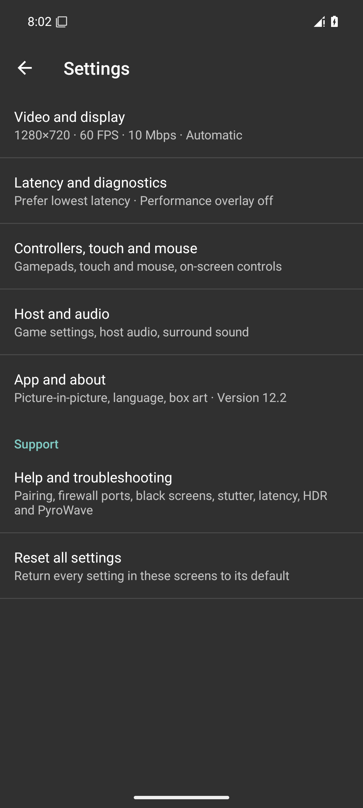
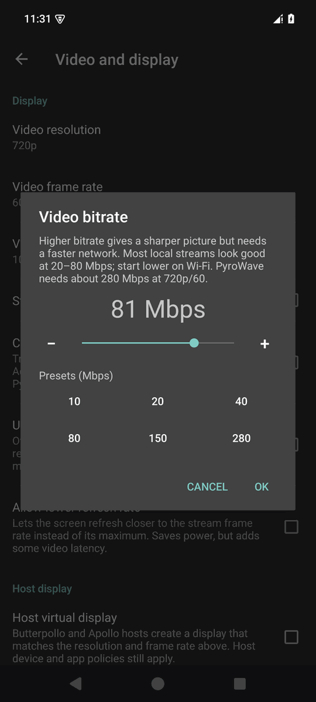
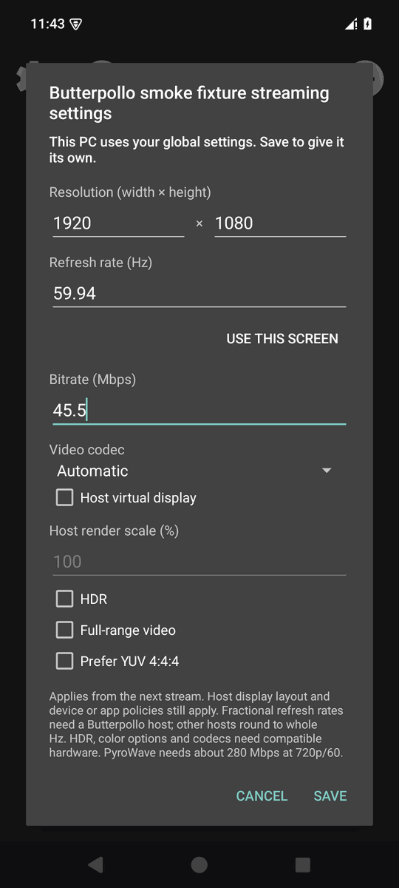
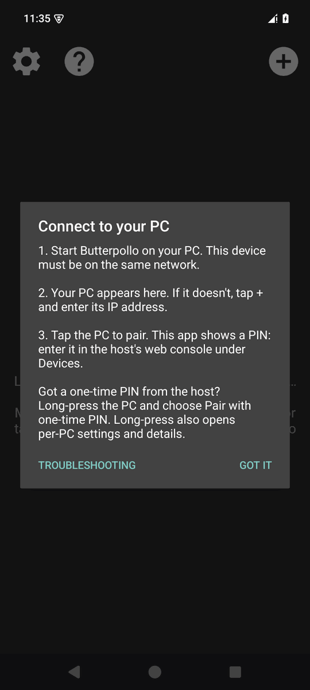
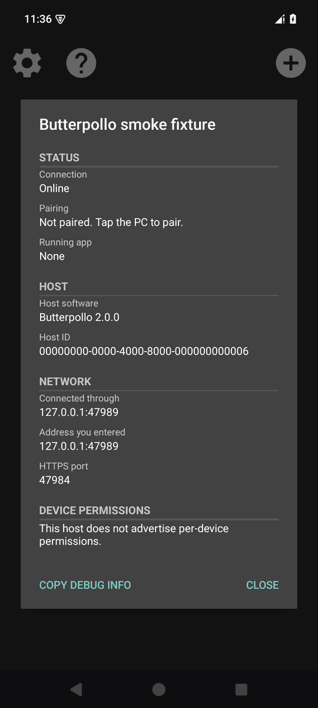
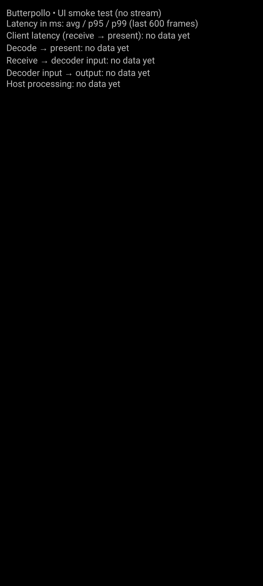

# Rubylight Android

Rubylight Android is a latency-focused client for [Rubylight](https://github.com/RamazanKara/Butterpollo),
based on Moonlight Android (GPL-3.0), with stock Sunshine and Apollo compatibility.

- Settings grouped into **Stream**, **Controls**, **Overlay & audio** and **App**, with expert
  options in **Advanced**. Search includes every group; preset chips show the matching preset or Custom.
- Material 3 PC cards with status chips, an **Add PC** button and grouped action sheets.
- Full-screen per-PC resolution, fractional refresh, bitrate, VRR, render scale, virtual-display,
  HDR, colour-range and codec profiles. Long-press a PC → **This PC → Streaming settings for this PC**;
  turn off **Use global settings** to edit, then **Save**.
- Trackpad, direct mouse and native multi-touch modes, with trackpad and mouse speed controls
  (25–400%, default 100%) under **Settings → Controls → Touch & mouse**, and a live on-screen gamepad layout editor.
- Multiple USB/Bluetooth controllers with device mappings, per-controller button remapping
  (**Settings → Controls → Controller buttons**), feedback and motion where supported;
  hardware keyboard/mouse input, Wake-on-LAN, pinned app shortcuts and picture-in-picture.
- Launch games from ES-DE, Daijisho or Pegasus: long-press a PC and select **Add games to ES-DE**.
  Game files use the Artemis `.art` format; see [frontends](docs/FRONTENDS.md).
- A stream bottom sheet for **Keyboard**, **Input mode**, **Overlay**, **Bitrate**, **Clipboard**,
  **Host commands**, **Disconnect** and **Quit app**, according to host permissions.
  Reconnect and host status are under **Host commands**.
  **Ctrl+Alt+Shift+S** toggles the performance overlay; **Ctrl+Alt+Shift+M** opens the menu.
- **Compact** is the default overlay: one corner line with shown FPS, total latency (network RTT +
  completed decode) and frame loss, including PyroWave. Missing measurements are hidden. The health
  dot is green below 30 ms and 1% loss, amber from either threshold or with incomplete measurements,
  and red from 60 ms or 5% loss. Long-press the overlay or use **stream menu → Overlay** to switch to
  **Advanced**, grouped into Video, Network, Decode and Host; scroll for details on small screens.
  **Copy stats** always copies all Advanced measurements. Both modes hide in PiP. Legacy Expanded
  values reset to Compact once because Android also saved that value for untouched defaults;
  newly selected Advanced preferences persist.
- Opt-in automatic bitrate for Rubylight H.264/HEVC/AV1 streams, saved per PC, with loss-driven
  reductions, gradual recovery and host-cap handling. Manual bitrate selection disables it.
- Per-frame latency overlay/CSV and Android low-latency controls under **Settings → Advanced**.
- Native-resolution, high-refresh virtual-display requests with host render scale.
- HEVC/AV1 HDR10 with display metadata; capability-gated YUV 4:4:4 with 4:2:0 fallback.
- Experimental PyroWave is an explicit codec choice on compatible Vulkan devices; Auto keeps H.264/HEVC/AV1.
  PyroWave needs a fast LAN and much higher bitrate (about 280 Mbps to start at 720p/60).
- A cancellable, explicitly started PyroWave bandwidth test for compatible paired Rubylight hosts
  downloads 32 MiB and reports HTTPS throughput and the host link speed.
- Host processing avg/p95/p99 beside client latency, and persistent per-device identity that is
  excluded from Android backups/device transfer. Restored installations need fresh pairing.
- Ordinary PIN or host-generated one-time PIN/passphrase pairing; UUID-aware app shortcuts,
  host library order and versioned artwork updates.
- Foreground text clipboard transfer, permission-aware host actions and encrypted server commands.
- Opt-in variable refresh (VRR) for Rubylight's VRR mode: the host sends frames at the game's
  rate and the phone shows each one right away at its highest refresh rate.
- A stream menu for disconnect/resume, device permissions, host frame-limiter status and runtime bitrate.
- Settings split into Video, Latency, Input, Host and App screens with a title bar, a summary of the
  current stream setup, and **Reset all settings** (keeps paired PCs, per-PC settings, controller
  button mappings and the on-screen control layout). Conservative 720p/60, automatic codec and low-latency decoding defaults.
- A bitrate dialog built for LAN rates: logarithmic slider, -/+ fine steps and presets from 10 Mbps
  to the 280 Mbps PyroWave starting point.
- A short, skippable pairing guide on first launch (also behind the **?** button), and readable
  host details with **Copy debug info** for support reports.

See [the low-latency roadmap](docs/ROADMAP-LOWLATENCY.md) for what is measured, what is next and how this
client compares with Moonlight and Artemis. [The host parity matrix](docs/PARITY-MATRIX.md) lists every
Rubylight host feature and its status here. See [the parity audit and device-testing checklist](docs/BUTTERPOLLO_PARITY.md) for PyroWave feasibility
findings, supported host extras and known limits. Having trouble? See [troubleshooting](docs/TROUBLESHOOTING.md)
for pairing, firewall ports, black screens, stutter, latency, HDR and PyroWave requirements.

## Install

1. Download the `butterpollo-debug` artifact from a successful
   [Android debug workflow](https://github.com/RamazanKara/butterpollo-android/actions/workflows/android.yml)
   and extract `app-nonRoot-debug.apk`, or build it below. Android 5.0 or later is required; no root needed.
2. Open the APK on your Android device and allow installation from your file manager when prompted,
   or run `adb install -r app-nonRoot-debug.apk` with USB debugging enabled.
3. Start [Rubylight](https://github.com/RamazanKara/Butterpollo) on your PC. Select the discovered
   host (or use **Add PC** to enter its address), then enter the displayed PIN in **Devices** in the host
   web console. Grant this device the desired list, launch and input permissions there.
4. Launch an app. Android **Back**, or **Ctrl+Alt+Shift+M** on a keyboard, opens the stream menu.
   Clipboard transfer is plain text, explicitly initiated, and requires an active session plus the
   corresponding host permission. Server commands are the host's configured commands; sending one
   does not confirm its execution. **Disconnect** leaves the host application running;
   select the same app to resume. It does not suspend the game process.

Local release builds produce an unsigned APK. **Unsigned APKs cannot be installed directly.**
Copy it to `butterpollo-unsigned.apk`, then put JDK 17 and Android SDK Build Tools on your PATH:

```sh
keytool -genkeypair -keystore butterpollo.keystore -alias butterpollo -keyalg RSA -keysize 3072 -validity 10000
zipalign -P 16 -f 4 butterpollo-unsigned.apk butterpollo-aligned.apk
apksigner sign --ks butterpollo.keystore --ks-key-alias butterpollo --out butterpollo.apk butterpollo-aligned.apk
apksigner verify --verbose butterpollo.apk
adb install -r butterpollo.apk
```

Create the keystore once and keep it for updates; tools prompt for its password. See Android's
[APK signing instructions](https://developer.android.com/tools/apksigner). CI has no signing secrets.
Debug builds from different CI runs may use different keys; switching keys requires uninstalling
the old app (which removes its settings and pairing identity). Rubylight installs alongside Moonlight.

## Building

Install JDK 17, Android SDK Platform 37 and NDK `29.0.14206865` through Android Studio/SDK Manager,
accept the SDK licenses, and set `ANDROID_HOME` (or `sdk.dir` in untracked `local.properties`).
On Windows, use PowerShell and the Windows toolchains:

```powershell
git submodule update --init --recursive --jobs 2
$env:ANDROID_HOME = "$env:LOCALAPPDATA\Android\Sdk"
.\gradlew.bat --no-daemon --max-workers=2 :app:assembleNonRootDebug :app:lintNonRootDebug :app:testNonRootDebugUnitTest
```

The debug APK is `app/build/outputs/apk/nonRoot/debug/app-nonRoot-debug.apk`. Use
`:app:assembleNonRootRelease` for the unsigned release APK under `app/build/outputs/apk/nonRoot/release/`.
On Linux/macOS use `bash gradlew` with the same arguments. Native compilation and unit test forks
are capped at two. The single GitHub Actions job builds debug, runs lint, unit tests and native parser
tests on pushes to `main` and manual dispatch. It does not publish releases. Protocol fixtures are
synthetic; the parity document lists required real-device checks.

After building debug, run `python scripts/emulator-smoke.py` with Python 3, the SDK above and the
`sunset` Android 35 AVD installed. It refuses to start alongside another emulator, uses a headless,
disposable AVD session, installs the APK, manually adds a loopback server-info fixture, opens settings, checks Advanced search and per-PC global inheritance, and captures the UI at
393 dp and 412 dp with default fonts, plus 393 dp at font scale 1.3. It also checks both production
overlay formats in a debug-only screen, including rotation and long-press switching. The preview uses clearly labeled synthetic measurements.
Screenshots go to `docs/screenshots/ui-v2/` (native dimensions, palette PNG when Pillow is installed); UI dumps and logcat go to `app/build/emulator-smoke/`.
The emulator is stopped in a `finally` block. The fixture holds the pairing PIN prompt open but does not complete pairing or stream.
The debug overlay activity is absent from release builds. Overlay captures are `overlay-compact.png`
and `overlay-advanced.png`, with `-landscape` variants. Send the two portrait captures to the Opus
xhigh screenshot judge before test.5. This runner did not run an emulator or capture these images;
the caller must run the smoke pass, add live **stream menu** captures for the same three viewport/font
sets under `docs/screenshots/ui-v2/`, and check host permission filtering, Quit app confirmations,
mode persistence, Copy stats, the keyboard shortcut, German labels and PiP on a phone.

The smoke test also walks the pairing guide, the one-time PIN and host details dialogs, per-PC profile
input, saving, reopening and resetting, the settings screens, the bitrate dialog and Reset all settings.
These are emulator captures, not evidence of hardware decoding or a live host connection.

| Settings | Bitrate | Per-PC streaming settings |
| --- | --- | --- |
|  |  |  |

| Pairing guide | Host details | Performance overlay |
| --- | --- | --- |
|  |  |  |

## Upstream Moonlight

[](https://ci.appveyor.com/project/cgutman/moonlight-android/branch/master)
[](https://hosted.weblate.org/projects/moonlight/moonlight-android/)

[Moonlight for Android](https://moonlight-stream.org) is an open source client for NVIDIA GameStream and [Sunshine](https://github.com/LizardByte/Sunshine).

Moonlight for Android will allow you to stream your full collection of games from your Windows PC to your Android device,
whether in your own home or over the internet.

Moonlight also has a [PC client](https://github.com/moonlight-stream/moonlight-qt) and [iOS/tvOS client](https://github.com/moonlight-stream/moonlight-ios).

You can follow development on our [Discord server](https://moonlight-stream.org/discord) and help translate Moonlight into your language on [Weblate](https://hosted.weblate.org/projects/moonlight/moonlight-android/).

## Authors

* [Cameron Gutman](https://github.com/cgutman)  
* [Diego Waxemberg](https://github.com/dwaxemberg)  
* [Aaron Neyer](https://github.com/Aaronneyer)  
* [Andrew Hennessy](https://github.com/yetanothername)

Moonlight is the work of students at [Case Western](http://case.edu) and was
started as a project at [MHacks](http://mhacks.org).

Apollo extension behavior was cross-checked against [Artemis Android](https://github.com/ClassicOldSong/moonlight-android)
by ClassicOldSong and contributors (GPL-3.0), with Rubylight protocol differences handled explicitly.
Moonlight attribution and the [GPL-3.0 license](LICENSE.txt) are retained.
