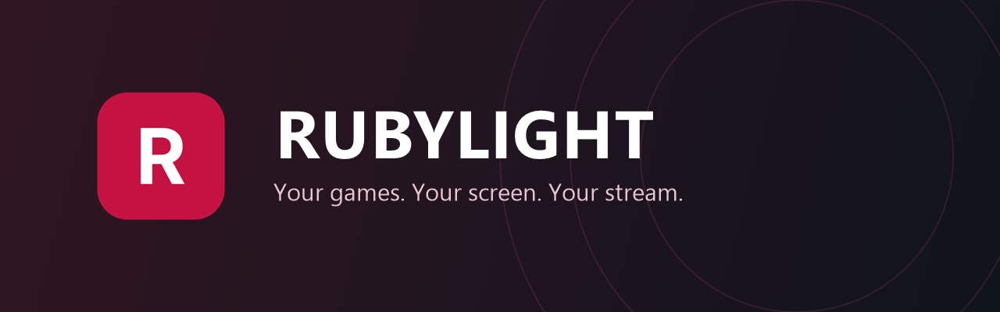
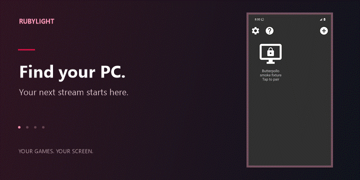
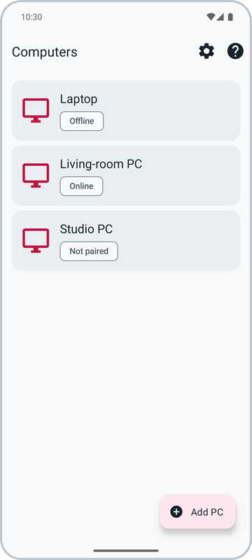
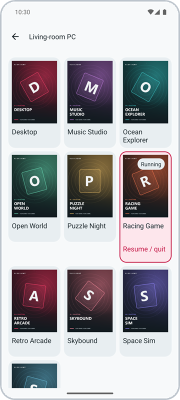
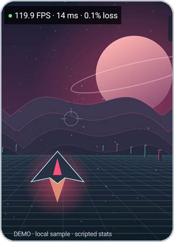
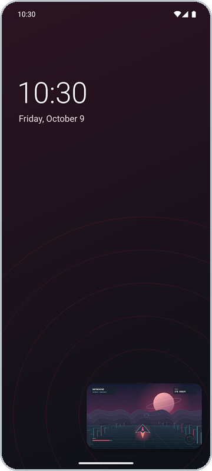

  

Stream your PC games and desktop to Android, with ultra-low latency and the controls you love.

  

<a href="https://github.com/RamazanKara/rubylight-android/releases">Watch the full demo →</a>

  

  
  
  
  

## Features

- **React instantly** with ultra-low latency streaming and decoding.
- **See every detail** with AV1, HEVC and H.264 video, plus HDR10.
- **Keep motion fluid** with high refresh rates and VRR frame pacing.
- **Sharpen your stream** with client-side FSR and Snapdragon GSR upscaling.
- **Play your way** with USB and Bluetooth controllers, including DualSense.
- **Stay in control** with touch, trackpad, mouse, keyboard and on-screen controls.
- **Know your stream** with a performance overlay for FPS, latency and frame loss.
- **Get playing sooner** with automatic PC discovery and Wake-on-LAN.

## Quick start

1. **Set up your PC:** start the [Rubylight host](https://github.com/RamazanKara/Rubylight) and add your games.
2. **Install on Android:** [download the APK](https://github.com/RamazanKara/rubylight-android/releases/latest) and open it.
3. **Connect and pair:** select your PC on the same network and enter the PIN shown on your phone in the host's **Devices** page.
4. **Start your stream:** allow permissions, open your library and tap a game.

## Docs

[Start here](docs/index.md) · [Quick start](docs/quick-start.md) · [Pairing](docs/pairing.md) · [Settings](docs/settings.md) · [Controls](docs/controls.md) 
[Video & latency](docs/video-and-latency.md) · [Troubleshooting](docs/troubleshooting.md) · [Building](docs/building.md) · [Frontends](docs/frontends.md) · [FAQ](docs/faq.md)

[GPL-3.0](LICENSE.txt) · [Credits and third-party notices](docs/index.md#license-and-credits)
